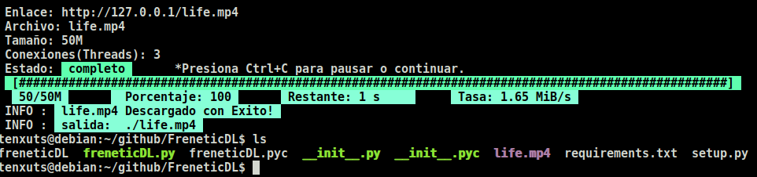

# FreneticDL
==========================================
Potente CLI(interfaz de línea de comandos) atractiva  para descargar archivos utilizando segmentacion y concurrencia.
==========================================

**Caracteristicas:**
* utiliza la infalible tecnica de segmentacion dinamica para redes con baja latencia.
* segmentacion concurrente.
* capacidad para pausar/continuar Ctrl+C
* validacion de segmentos inicio y final.
* multiples reconexiones por perdidad de red.
* personalizar cabezeras HTTP , cookies, user-agent.
* CLI agradable con la informacion que necesitas.
**

**Instalacion:**
============
* ``recomendable usar virtualenv``
* ``git clone https://github.com/CristoferDevPy/FreneticDL.git``
* ``cd FreneticDL/``
* ``python setup.py install``

**Uso:**
============
* ``./freneticDL.py -u http://127.0.0.1/debian.iso``
* ``./freneticDL.py -u http://127.0.0.1/debian.iso -o kde.iso -c distro``
* ``./freneticDL.py -u http://127.0.0.1/debian.iso -t 5``
